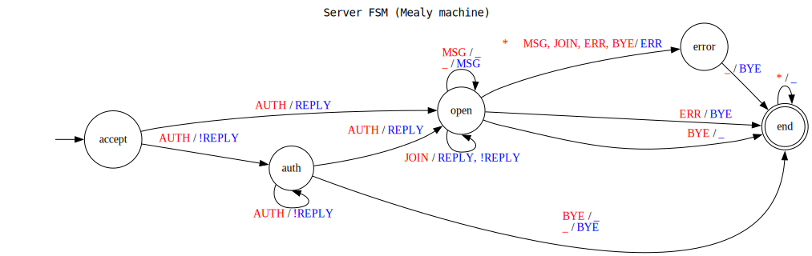

# IPK Project 2: Chat server using `IPK24-CHAT` protocol

>  The key words "MUST", "MUST NOT", "REQUIRED", "SHALL", "SHALL NOT", "SHOULD", "SHOULD NOT", "RECOMMENDED",  "MAY", and "OPTIONAL" in this document are to be interpreted as described in RFC 2119 [RFC2119].

This project's task is to design and implement a server application capable of communicating with remote clients using the `IPK24-CHAT` protocol.
The protocol has got two variants - each built on top of a different transport protocol.
**You are required to implement both variants.**
Please focus on the networking aspects of this project as much as possible.

## Table of Contents

- [IPK Project 2: Chat server using `IPK24-CHAT` protocol](#ipk-project-2-chat-server-using-ipk24-chat-protocol)
  - [Table of Contents](#table-of-contents)
  - [Specification](#specification)
    - [Handling `AUTH`](#handling-auth)
    - [Handling `JOIN`](#handling-join)
    - [Handling `MSG`](#handling-msg)
    - [Handling `ERR`](#handling-err)
    - [Handling `BYE`](#handling-bye)
  - [Program Execution](#program-execution)
    - [CLI arguments](#cli-arguments)
    - [Server output](#server-output)
  - [Functionality Illustration](#functionality-illustration)
    - [Server input/output](#server-inputoutput)
  - [Submission](#submission)
  - [Evaluation](#evaluation)
  - [Contributing](#contributing)
  - [Bibliography](#bibliography)

## Specification
The general specification of the `IPK24-CHAT` protocol stays the same as has been defined in the [Specification section](https://git.fit.vutbr.cz/NESFIT/IPK-Projects-2024/src/branch/master/Project%201#specification) of [Project1].
For the purposes of clarity the specification will not be duplicated here.
This will help prevent error-prone synchronisation of the same specifition at two places at once.
Please refer to the [Project1] assignment for detailed information about general protocol specifications.

Behaviour of the server shall conform to the following Mealy machine (finite state machine).
<span style="color:red">Red values</span> indicate client-sent messages (input) to the server.
<span style="color:blue">Blue values</span> correspond to the server-sent messages (output) to the client.
There are few important notes as for the schema interpretation:

- the underscore (`_`) value represents *no message* (e.g., no input is received, no output is sent),
- the star (`*`) value represents *all possible messages* (e.g., any input is received),
- when multiple values are specified on the input/output positions they are to be interpreted as "any one of",
- `REPLY` and `!REPLY` correspond to the same message type, the exclamation mark (`!`) represents a negative version of the reply,
- receiving any client message other than any of the accepted by the corresponding state results in a transition to the `error` state, output of the error message (same way as shown in the `open -> error` transition) and continuation from the FSM `error` state - these transitions were omitted from the diagram for the purposes of clarity.



The flowchart diagrams in the table below define behaviour for common actions of the server.
User authentication (invoked upon receiving the `AUTH` message), joining/switching a channel (caused by the client `JOIN` message) and receiving a chat message to be sent (the `MSG` message).
Please read the following sections for more key details on processing particular message types done by the server.

| User authentication                         | Channel join                                 | Receive message                              |
| :-----------------------------------------: | :------------------------------------------: | :------------------------------------------: |
|  |  |   |

In case any of the received messages contain invalid characters, are missing fields or are otherwise malformed, the server shall send an `ERR` message to the client and is allowed to initiate **graceful termination** the session at that point.
Graceful termination is achieved by sending the `BYE` message.

> <span style="color: orange">Keep in mind that the message sent in case of the UDP protocol variant **must be confirmed** by the remote party before irreversibly terminating the network connection.
Similarly, TCP connections must be terminated gracefully with both sides using `FIN` not `RST` TCP flags.
</span>

> <span style="color: orange">It is, of course, **required and absolutely necessary** for the server to be able to handle multiple client connections at once.
</span>

> <span style="color: orange">The server must support both protocol variants.
Clients using different transport protocols must be able to communicate with each other seamlessly.
</span>

### Handling `AUTH`
A message of this type is only accepted in the beginning of the conversation with a client (as defined by the server FSM above).
A successful user authentication must be done only once per user connection.
The authentication result is conveyed to the user using the `REPLY` message.
The reason content string provided via the `REPLY` message is implementation-defined.
This assignment does not define any particular message to be sent in either case (successful or unsuccessful).
The only requirement is that there is such a non-empty and context-relevant message.

The `Username` is a **unique account identifier** in this context.
No real authentication is required by the assignment; however, this offers a possibility of your own project extension (implementing support for an authentication provider, from `csv` or `json` files).

After a successful authentication, the server shall automatically (without receiving the `JOIN` message from the client) join the corresponding user connection to a default server channel.
Upon user successfully joining to a channel the server is required to "broadcast" a message to all users connected to the channel, with display name `Server` and content `{DisplayName} has joined {ChannelId}.`.

There is no required limit for a number of active successfully authenticated connections for a single user.
Your implementation may allow only a single one or multiple.
Make sure to mention and explain your reasoning behind this feature decision in your documentation.

> <span style="color: orange">It is required that, by default, any combination of a valid username (`Username`), display name (`DisplayName`) and secret (`Secret`) will be authenticated successfully by the server.
Assuming a single connection per unique user account (username) at the most.
Any potential extension must be toggleable by a command line argument or an environment variable.
</span>

### Handling `JOIN`
This message can only be accepted and processed once a user has been successfully authenticated.
Joining a channel should always succeed unless implementation limitations intentionally prevent the client from doing so.
An example of a valid channel join failure is a malformed channel id.

The server is required to obide by the following rules:
- a single user connection can only be active/joined in a single server channel,
- there is no active connection limit to chat channels,
- if the channel does not exist it must be created (this must not limit the users' ability to join channels),
- a valid `REPLY` message is always sent after the join operation to indicate its success/failure along with a relevant reason string.

Upon user successfully joining to a channel the server is required to "broadcast" a message to all users connected to the channel, with display name `Server` and content `{DisplayName} has joined {ChannelId}.`
Similarly, when leaving a channel, the server shall send `{DisplayName} has left {ChannelId}.` in the same manner as defined before.

### Handling `MSG`
Messages from user clients can only be accepted once the connection has been successfully authenticated and the connection has been joined to a chat channel.
After the content validation is performed, the received message contents are forwarded, as is, to all of the clients connected to the same chat channel, **except for the original message sender**.

The server is required to obide by the following rules:
- only messages with valid `DisplayName` and `MessageContent` values are allowed to be forwarded to others,
- users must be allowed to change their `DisplayName` in each message they send,
- server shall never use the `Username` of the authenticated user as their `DisplayName`,
- it is unnecessary to track the user display name within the server application.

### Handling `ERR`
When an `ERR` message is received from a client it means that a serious protocol or internal program error has occured and the client is likely unable to continue working properly.
Receiving this message shall result in an attepmt to gracefully terminate the appropriate user session (connection).

Note: both the client and the server may send `BYE` message to each other at this point.
Make sure these are correctly delivered and confirmed when necessary.
Also, do not forget to clean up after the user session is terminated.

### Handling `BYE`
This is the final message in a conversation.
It signifies that the session is over and is a direct step to graceful connection termination.
To correctly process this message, the server shall:
- properly remove the user from their curretnly joined channel, if any,
- clean up any dynamically allocated resources dedicated to this user session.

## Program Execution
This section defines the required behaviour and interface of the implemented server application on program execution level.

### CLI arguments
The implemented program must support and respect command line arguments as defined in the table below.
It is required to have corresponding program subsystems parameterisable by these values at minimum.

| Argument | Value     | Possible values | Meaning or expected program behaviour
| -------- | --------- | --------------- | -------------------------------------
| `-l`     | `0.0.0.0` | IP address      | Server listening IP address for welcome sockets
| `-p`     | `4567`    | `uint16`        | Server listening port for welcome sockets
| `-d`     | `250`     | `uint16`        | UDP confirmation timeout
| `-r`     | `3`       | `uint8`         | Maximum number of UDP retransmissions
| `-h`     |           |                 | Prints program help output and exits

> <span style="color:orange">Edge cases of argument processing will not be a part of evaluation (e.g., providing argument more than once, providing invalid argument value, providing unknown arguments).
Application behaviour is expected to be undefined in such cases.
</span>

Arguments with "<span style="color:orange">User provided</span>" text in the value column are mandatory and have to be always specified when running the program.
Other values indicate the argument is optional with its default value defined in the column (or no value at all).

> <span style="color:deepskyblue">Your program may support more command line arguments than defined above.
Make sure there is no name or behaviour clash between the required arguments and the custom ones.
</span>

### Server output
The server program shall log any and all incomming client messages along with all messages sent to the clients by the server.
The logging output must be sent to standard output stream (`stdout`).
The messages must be in the following format:
```
RECV {FROM_IP}:{FROM_PORT} | {MESSAGE_TYPE}[MESSAGE_CONTENTS]\n
```
```
SENT {TO_IP}:{TO_PORT} | {MESSAGE_TYPE}[MESSAGE_CONTENTS]\n
```

Where `{MESSAGE_TYPE}` must be one of message type keywords as defined in the general protocol specification [Project1] (e.g., `AUTH`, `ERR` or `JOIN`).
Logging the parsed contents of the messages (`[MESSAGE_CONTENTS]`) is optional.
Content logging should be done in the following format `Property=Value` each separated by a space, e.g., `Username=user1 DisplayName=User1 Secret=xXx`.

This assignment does not specify a required use for standard error output stream (`stderr`) of the server application.
However, it is highly recommended to use standard error output stream for your own debug logging.
This logging may stay enabled even in the submitted version of your program.
It may later provide more insight into what went wrong in case the evaluation should not go according to your ideals.
Please refrain from logging any non-printable characters/binary values (e.g., unparsed UDP message contents) or huge amounts of content.

## Functionality Illustration
Please refer to the [Functionality Illustration section](https://git.fit.vutbr.cz/NESFIT/IPK-Projects-2024/src/branch/master/Project%201#functionality-illustration) of [Project1] for all relevant protocol functionality illustrations.
This section will further show only server application-specific input/output examples.

### Server input/output
The following snippet shows an example `stdout` content for a server communicating with a single UDP client:
```
RECV 127.0.0.1:51364 | AUTH
SENT 127.0.0.1:51364 | CONFIRM
SENT 127.0.0.1:51364 | REPLY
RECV 127.0.0.1:51364 | CONFIRM
RECV 127.0.0.1:51364 | MSG
SENT 127.0.0.1:51364 | CONFIRM
RECV 127.0.0.1:51364 | MSG
SENT 127.0.0.1:51364 | CONFIRM
RECV 127.0.0.1:51364 | JOIN
SENT 127.0.0.1:51364 | CONFIRM
SENT 127.0.0.1:51364 | REPLY
RECV 127.0.0.1:51364 | CONFIRM
RECV 127.0.0.1:51364 | BYE
SENT 127.0.0.1:51364 | CONFIRM
RECV 127.0.0.1:51364 | BYE
SENT 127.0.0.1:51364 | CONFIRM
```

This is what would the same conversation with a TCP client look like:
```
RECV 127.0.0.1:51364 | AUTH
SENT 127.0.0.1:51364 | REPLY
RECV 127.0.0.1:51364 | MSG
RECV 127.0.0.1:51364 | MSG
RECV 127.0.0.1:51364 | JOIN
SENT 127.0.0.1:51364 | REPLY
RECV 127.0.0.1:51364 | BYE
```

## Submission
The submission must follow all the requirements described in the [general project specifications README](https://git.fit.vutbr.cz/NESFIT/IPK-Projects-2024/src/branch/master/README.md).
Running the `make` command (using the default Makefile target) in the project root shall build a single executable called `ipk24chat-server` and place it in the project root as well.
The resulting executable may be implemented as a wrapper/launcher; however it is required to conform to the command line interface as described above.

## Evaluation
This assignment will be graded with up to **20 points**.
The actual functionality and code quality will be graded with up to 14 points.
Project's documentation will be graded with up to 6 points (please refer to the [documentation instructions](https://git.fit.vutbr.cz/NESFIT/IPK-Projects-2024#documentation-instructions) to see, what a good documentation is required to contain).
The distribution and general assesment rules are in accordance to the [general project evaluation criteria](https://git.fit.vutbr.cz/NESFIT/IPK-Projects-2024#evaluation).

> <span style="color: orange">Please note that not all parts of the assignment are equally challenging to implement and will be, as a result, graded differently.
</span>

## Contributing
If you notice anything that you think could be improved on this project assignment, please, feel free to propose a change/fix or an idea to do so.
You can use the [pull request](https://git.fit.vutbr.cz/NESFIT/IPK-Projects-2024/pulls) or [repository issues](https://git.fit.vutbr.cz/NESFIT/IPK-Projects-2024/issues) features of Gitea for this.
If you are unsure of doing so publicly, feel free to reach out using an email beforehand.

> <span style="color: orange">Please note that the specification/assignment related <ins>questions</ins> should be asked through the [e-learning portal forum for Project 2](https://moodle.vut.cz/mod/forum/view.php?id=402690).
</span>

## Bibliography

[RFC2119] Bradner, S. _Key words for use in RFCs to Indicate Requirement Levels_ [online]. March 1997. [cited 2024-02-14]. DOI: 10.17487/RFC2119. Available at: https://datatracker.ietf.org/doc/html/rfc2119

[Project1] Dolejška, D. _Client for a chat server using IPK24-CHAT protocol_ [online]. February 2024. [cited 2024-02-14]. Available at: https://git.fit.vutbr.cz/NESFIT/IPK-Projects-2024/src/branch/master/Project%201

[RFC5234] Crocker, D. and Overell, P. _Augmented BNF for Syntax Specifications: ABNF_ [online]. January 2008. [cited 2024-02-14]. DOI: 10.17487/RFC5234. Available at: https://datatracker.ietf.org/doc/html/rfc5234

[RFC9293] Eddy, W. _Transmission Control Protocol (TCP)_ [online]. August 2022. [cited 2024-02-14]. DOI: 10.17487/RFC9293. Available at: https://datatracker.ietf.org/doc/html/rfc9293

[RFC768] Postel, J. _User Datagram Protocol_ [online]. March 1997. [cited 2024-02-14]. DOI: 10.17487/RFC0768. Available at: https://datatracker.ietf.org/doc/html/rfc768

[RFC1350] Sollins, D. _The TFTP Protocol (Revision 2)_ [online]. July 1992. [cited 2024-02-12]. DOI: 10.17487/RFC1350. Available at: https://datatracker.ietf.org/doc/html/rfc1350
